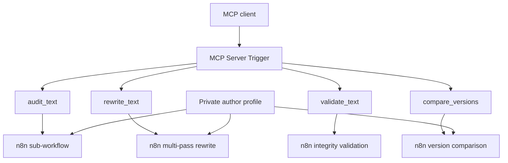

# Authorial Editor

**Authorial Editor** is an open-source, MCP-compatible editorial engine for analysing and revising AI-assisted drafts at discourse level while preserving factual claims, provenance, and author intent.

It is inspired by the discourse-level methodology introduced in **StoryScope: Investigating idiosyncrasies in AI fiction** (Russell et al., COLM 2026), but adapts the idea to editorial/non-fiction workflows.

> [!IMPORTANT]
> Authorial Editor is **not** an AI detector, **not** an AI-detector bypass tool, and **not** a generic paraphraser. Its goal is editorial quality, traceability, factual preservation, and authorial consistency.

## Status

Current release: `v0.1.0-alpha.2`

This release is intentionally conservative. It provides:

- an n8n MCP gateway;
- four MCP tools: `audit_text`, `rewrite_text`, `validate_text`, `compare_versions`;
- multi-pass analysis rather than a single monolithic prompt;
- a factual/source lock before rewriting;
- discourse-level audit using an interpretable editorial taxonomy;
- structural rewrite + surface pass;
- post-rewrite integrity validation;
- an author-profile schema and example profile;
- importable n8n workflow JSON files;
- scripts to wire workflow IDs and validate the package.

Automatic author-profile generation and author-specific feature discovery are planned for later releases.

## Architecture



The public repository contains only the engine, schemas, workflows, taxonomy, documentation, and an example author profile. Real author corpora and private profiles should stay outside this repository.

## Why multi-pass?

StoryScope reports that applying features dimension-by-dimension produced substantially more complete feature vectors than a single-call approach. Authorial Editor carries that architectural lesson into editorial revision by separating source locking, discourse analysis, rewriting, surface editing, and validation.

The non-fiction feature mappings in this repository are **adaptations and hypotheses**, not findings validated by the StoryScope paper. See [`docs/METHODOLOGY.md`](docs/METHODOLOGY.md).

## Quick start with n8n

1. Import the four sub-workflows in this order:

   - `workflows/10-audit-text.json`
   - `workflows/20-rewrite-text.json`
   - `workflows/30-validate-text.json`
   - `workflows/40-compare-versions.json`

2. In each imported workflow, configure the **OpenRouter Chat Model** credentials and select the models you want to use.

3. Copy the n8n workflow ID of each imported sub-workflow.

4. Generate a wired MCP gateway:

```bash
python scripts/wire_router.py \
  --audit-id YOUR_AUDIT_ID \
  --rewrite-id YOUR_REWRITE_ID \
  --validate-id YOUR_VALIDATE_ID \
  --compare-id YOUR_COMPARE_ID \
  --output workflows/00-authorial-editor-mcp.wired.json
```

5. Import `workflows/00-authorial-editor-mcp.wired.json`.

6. Publish/activate the four sub-workflows and the MCP gateway as required by your n8n setup.

7. Open the MCP Server Trigger in n8n and use its production MCP URL in a compatible MCP client.

See [`docs/N8N_SETUP.md`](docs/N8N_SETUP.md) for details.

> [!NOTE]
> As of 2026-09-18, OpenAI documents custom MCP apps in ChatGPT as web-only, not mobile. ChatGPT product availability is separate from the Authorial Editor MCP server itself. See [`docs/CHATGPT_MCP.md`](docs/CHATGPT_MCP.md).

## MCP tools

### `audit_text`

Analyses a draft without rewriting it.

Inputs:

- `text` — required
- `content_type` — optional
- `profile_json` — optional JSON string containing an author profile

Returns a source lock, discourse audit, rewrite priorities, and protected elements.

### `rewrite_text`

Runs the full pipeline:

```text
Source Lock
    ↓
Discourse Audit
    ↓
Structural Rewrite
    ↓
Surface Pass
    ↓
Integrity Check
```

It must not invent facts, sources, quotations, personal experiences, or new claims.

### `validate_text`

Compares an original text with a candidate revision and reports lost, invented, or distorted claims.

### `compare_versions`

Produces a structured editorial comparison of two versions without choosing an author or declaring one "more human".

## Author profiles

`profiles/example.profile.json` demonstrates the public schema.

A real profile should be stored outside the public repository, for example:

```text
/private/authorial-editor/profiles/my-author.profile.json
```

Do not commit private corpora, unpublished drafts, personal anecdotes, credentials, or proprietary reference material.

## Provider independence

The included n8n workflows use the official n8n **OpenRouter Chat Model** node as the initial implementation because OpenRouter provides a provider-neutral gateway at runtime. The architecture does not depend on a specific underlying LLM.

The model values shipped in the JSON files are import-compatible defaults, not project recommendations. Choose models deliberately and evaluate changes before production use.

## Evaluation principles

A successful rewrite should optimize for:

1. factual preservation;
2. claim preservation;
3. source/provenance preservation;
4. authorial alignment when a profile is supplied;
5. reduction of unnecessary LLM discourse defaults;
6. no fabricated "human-like" noise.

The project deliberately does **not** optimize for detector evasion scores.

## Repository layout

```text
authorial-editor/
├── docs/
├── workflows/
├── schemas/
├── taxonomy/
├── profiles/
├── examples/
├── scripts/
└── .github/workflows/
```

## Roadmap

- `v0.1` — MCP editorial engine
- `v0.2` — automatic author profiling from a verified corpus
- `v0.3` — author-specific feature discovery using human-vs-AI mirror corpora
- `v0.4` — benchmark and public evaluation dataset
- `v1.0` — stable schemas and documented compatibility guarantees

## Methodological attribution

This project is inspired by:

> Jenna Russell, Rishanth Rajendhran, Chau Minh Pham, Mohit Iyyer, and John Wieting. *StoryScope: Investigating idiosyncrasies in AI fiction*. COLM 2026. arXiv:2604.03136.

StoryScope's official code is released under the MIT License. Authorial Editor does not currently copy StoryScope source code; it adapts methodological ideas and explicitly documents those adaptations.

See [`NOTICE.md`](NOTICE.md).

## License / Licenza

**EN**  
Authorial Editor is licensed under the **GNU Affero General Public License v3.0 only (AGPL-3.0-only)**. You may use, modify, redistribute, and use the software commercially under the terms of that license. If you modify the software and make the modified version available to users over a network, the corresponding source code must be made available as required by the AGPL.

**IT**  
Authorial Editor è distribuito secondo i termini della **GNU Affero General Public License v3.0 only (AGPL-3.0-only)**. È consentito utilizzare, modificare, ridistribuire e usare commercialmente il software nel rispetto della licenza. Se una versione modificata viene resa disponibile agli utenti attraverso una rete, il relativo codice sorgente deve essere reso disponibile secondo quanto previsto dalla AGPL.

The complete license text is available in [`LICENSE`](LICENSE). / Il testo completo della licenza è disponibile in [`LICENSE`](LICENSE).
